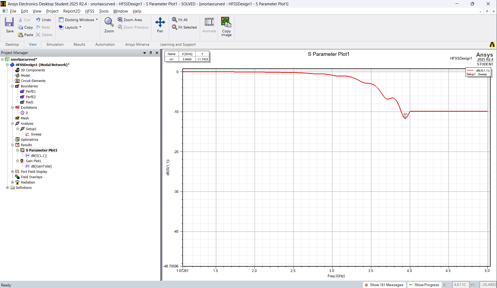
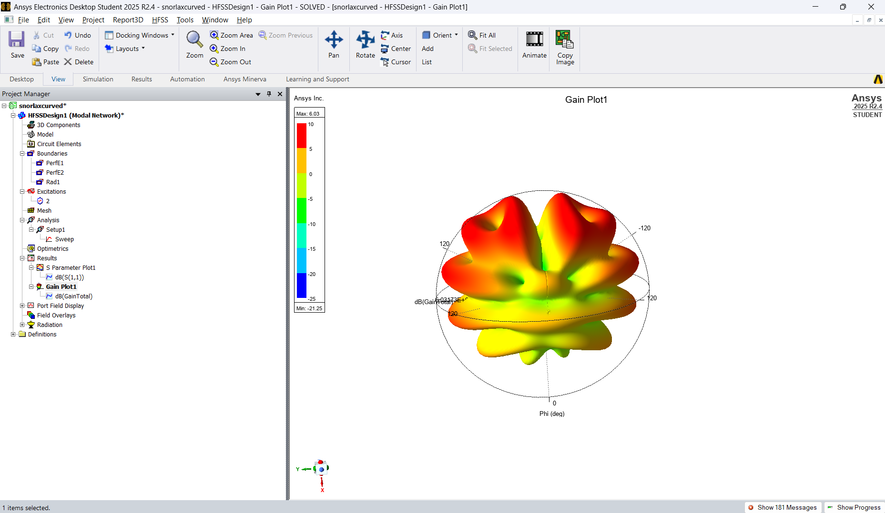

# ConformalAntenna

**Helmet-Mounted Conformal Antenna for Tactical Communications in Urban CQB Environments**
Smart India Hackathon 2026 — Problem Statement **26185** · Ministry of Home Affairs (MHA) · National Security Guard (NSG)

Team **SNORLAX**

---

## The Problem

NSG commandos operating in high-intensity urban Close-Quarter Battle (CQB) environments — closed rooms, basements, narrow corridors, stairwells — currently rely on vest-mounted handheld tactical radios with rigid, protruding whip antennas. This creates two operational problems:

- **Mechanical:** the antenna snags on doorframes, windows, and loose objects during fast movement, obstructing the operator and risking damage to the radio interface.
- **RF performance:** mounted low on the body, the antenna's signal suffers severe attenuation and fading inside reinforced-concrete or steel/glass structures, and its omnidirectional pattern increases vulnerability to directional tracking.

The requested solution moves the antenna to the **highest point on the commando — the helmet** — as a low-profile, flexible **conformal** antenna array, without compromising the helmet's ballistic protection.

## Our Approach

**1. RF & Antenna Design** — Conformal microstrip patch array, targeting UHF + L-band operation for handheld radios and helmet/body-worn camera video links.

**2. Simulation & Modelling** — Full-wave EM simulation in Ansys HFSS: baseline patch design, conformal mapping onto the helmet's curvature, RF shielding placement, and radiation-pattern optimization.

**3. Materials & Fabrication** — Flexible substrate (Kapton/flexible PCB), copper patch elements, AMC ground plane, designed for lightweight, rugged, helmet-integrated mounting.

**4. RF Electronics & Interface** — Ruggedized coaxial feed, connectors compatible with existing NSG handheld radios and body-worn camera systems.

**5. Testing & Power** — VSWR/S-parameter validation, radiation pattern and gain characterization, environmental and mechanical robustness testing.

### Methodology

```
Problem Definition -> Baseline Patch Design -> Conformal Mapping onto Helmet
     -> RF Shielding -> EM Simulation (HFSS) -> RF Optimization
     -> Prototype Integration -> Validation & Testing
```

---

## What's in This Repo

This repo holds the **HFSS electromagnetic simulation** validating the core conformal-patch concept — the first stage of the methodology above.

| File | Description |
|---|---|
| `snorlaxcurved.aedt` | Ansys HFSS model: a wraparound cylindrical conformal microstrip patch antenna, probe-fed, built around a curved dielectric substrate matching the helmet's surface geometry. |
| `s11RESULT.png` | Return loss (S11) result — confirms impedance match. |
| `radiationRESULT.png` | 3D far-field radiation pattern / gain result. |

### Simulation Results

**S11 (Return Loss)**



The conformal patch shows a validated resonance at **3.94 GHz, S11 = −11.74 dB** — a genuine sub−10dB impedance match on a curved, wraparound radiating structure. This confirms the conformal topology itself is electromagnetically sound: current flows correctly through the probe feed into a patch element bent around a cylindrical surface, and the structure resonates and matches as a real antenna, not just a flat approximation.

**Radiation Pattern**



### Model Details

| Parameter | Value |
|---|---|
| Topology | Wraparound cylindrical conformal patch (probe-fed lumped port) |
| Substrate | FR4_epoxy (placeholder for a flexible substrate — see roadmap) |
| Ground/patch conductor | Copper |
| Feed | Radial probe pin, 50Ω lumped port |
| Solver | Ansys HFSS, Driven Modal |
| Software | Ansys Electronics Desktop Student 2025 R2.4 |

---

## Status & Roadmap

This is a **first-stage proof-of-concept**: a single conformal patch element, validating that a wraparound curved patch can be modeled, fed, and matched correctly in HFSS. It is **not yet** the full system called for in the problem statement. Honestly tracking what's done vs. what's next:

- [x] Conformal (curved) patch geometry, correctly meshed and simulated
- [x] Working probe feed with real 2-conductor port contact
- [x] Validated impedance match (S11 < −10dB)
- [x] Far-field radiation pattern extracted
- [ ] Frequency retuning to the target L-band (~1.5GHz) — primarily a patch-dimension scaling exercise
- [ ] UHF-band element for dual-band operation
- [ ] RF shielding layer beneath the array (isolate the commando's head, direct radiation upward/outward)
- [ ] Flexible substrate (Kapton or similar) in place of the FR4 placeholder
- [ ] Multi-element conformal array (this repo currently models a single element)
- [ ] Ruggedized coaxial interface routing and helmet integration
- [ ] Physical prototype and bench testing

## Social & Operational Impact

- **Officer Safety** — safer communication during CQB operations
- **Tactical Mobility** — eliminates snagging and obstruction from the current whip antenna
- **Link Reliability** — reduced attenuation and fading inside structures
- **Mission Effectiveness** — more reliable tactical communication in the environments that matter most

---

*Built for Smart India Hackathon 2026 — Team SNORLAX*
